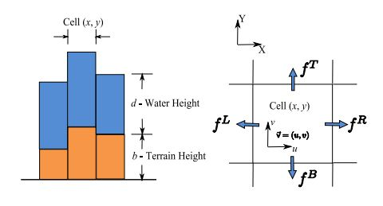
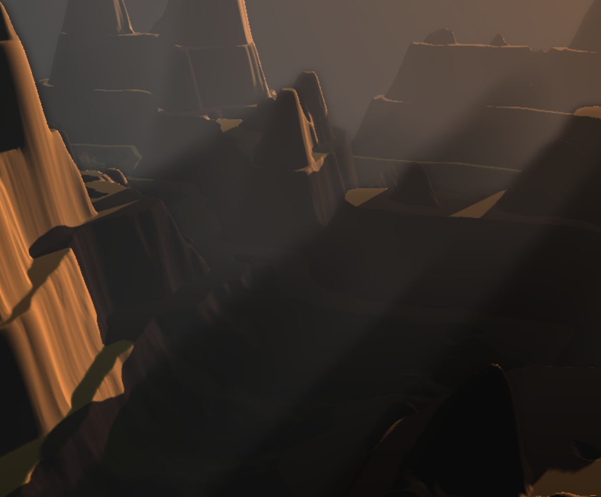
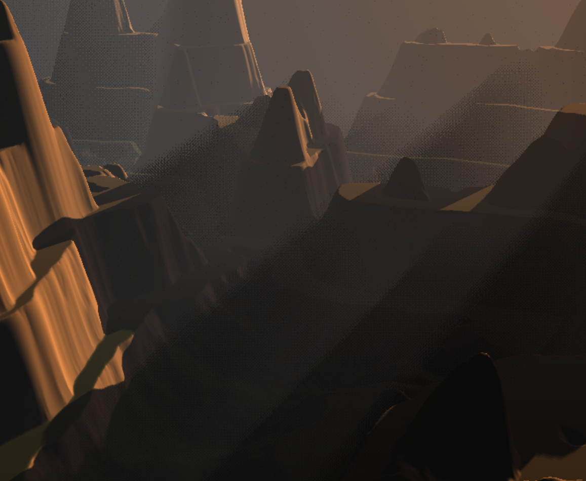

## Terrain erosion sandbox in WebGl


## controls : 

- press keyboard ```C``` to do terrain editions with brush, editions include : add/subtract for water and hight map for now, you can also adjust size of brush
- press keyboard ```R``` to place permanent water source. (note : 1 . press ```R``` again to remove permanent water source, 2 . after it's placed you can see a red circle marking the location, 3 . the size and strength of permanent water is equal to the brush size and strength the moment permanent water source is placed)
- press button ```Start/Resume``` to the right top corner to start or resume the erosion sim
- press button ```Pause``` to pause the simulation
- press button ```Reset``` to reset simulation and start with a new randomly generated base terrain
- use ```WaterTrabsparancy``` slider to control alpha of water
- use ```EvaporationDegree``` slider to control anomunt of evaporation you want each simulation step
- use ```Kc``` slider to control Kc (erosion capacity constant)
- use ```Ks``` slider to control Ks (erosion dissolvating constant)
- use ```Kd``` slider to control Kc (erosion deposition constant)
- use the dropdown to check the debug views
- press right mouse button to rotate camera, press left mouse button to translate camera, use middle mouse to scale...

## [**PLAY LIVE** (Chrome Recommended)]( https://lanlou123.github.io/Webgl-Erosion/)

## [**Demo Video showing sandbox feature**](https://youtu.be/Qly5emyyR_s)


## update 7/18/2021 : 
- I found lower sediment advection speed makes more realistic alluvial fans and meander effects, I already updated the parameters for that
## update 7/11/2021 : 
- permanent water source is added, you can pressed ```R``` to place it, see controls for details 
- added heatmeap for velocity magnitude in debug view, mapping color goes from blue to green then to red as the velocity size increases
- added MacCormack advection scheme for sediment advection, resulting in less numerical diffusion (referencing : ShaderX7 Advanced Rendering Techniques - starting page 207), you can find and toggle it on/off under ```erosionParameters``` in gui


### some screenshots
- more realistic alluvial fan & meander from smaller advection speed

- permanent water

- before
 
- after


#### updated sediment trace


### beautiful looking sediments traces 


 


### Base terrain generation:

- The initial terrain was generated using FBM and domain warping/terrace as an option, you can randomrize base terrain by clicking "Reset" botton

### Erosion

#### Two erosion process is applied here : hydraulic erosion sim is mainly based on ***Shallow water equation*** which is just the depth integration form of the famous viscous fluid equation Navier–Stokes equations, it's major algorithms are based on paper [Fast Hydraulic Erosion Simulation and Visualization on GPU](http://www-ljk.imag.fr/Publications/Basilic/com.lmc.publi.PUBLI_Inproceedings@117681e94b6_fff75c/FastErosion_PG07.pdf) (erosion), thermal erosion is using simmilar pipe model as hydraulic erosion to move slippage material depending on the ```Talus Angle```, major algorithm based on paper [Interactive Terrain Modeling Using Hydraulic Erosion](https://cgg.mff.cuni.cz/~jaroslav/papers/2008-sca-erosim/2008-sca-erosiom-fin.pdf)

-  **method overview** : following are some steps need to be followed sequentially according to the paper.

   - ***Increament water level*** : New water appears on the terrain due to two major effects: rainfall and river sources. For both types, we need tospecify the location, the radius and the water intensity (the amount of water arriving during ∆t). For river sources, the
location of the sources is fixed, for rain fall, all pixel have to be increment with water, the addition is simply : 
```d1(x,y) = dt(x,y) + deltaTime*rt(x,y)``` where rt(x,y) is the water arriving x,y per deltaTime.
   - ***Flow simulation*** :
      - Outflow flux computation : 
      as shown in the graph above, we need the in flow flux and out flow flux to compute overall volume change in current cell, as for flux, we need to calculate it through the height variation.
      the value of a flux in left direction, for example, can be calculated as 
      where height difference delta hL(x,y) can be calculated using  
      where K is a scaling factor to ensure the volume change doesn't exceed the current water height 
      
      - Water surface and velocity update:
        - water height is basically the change of water volume, which can be calculated with ```deltaTimes*(fin-fout)/(cellsizeX*cellsizeY)``` 
          as for the velocity, the paper also gives: 
       
   - ***Erosion and Deposition*** : 
      first thing in this step is to aquire the sediment capacity for current water volume, which is simply  , which is multiplication of terrain slope, capacity constant ```Kc``` and length of the current velocity
      second thing is to compare the current sediment with the capacity, if sediment > capacity, deposite some amount to current cell (Kd)
      else erode some from the current cell (Ks)
      
   - ***Sediment transportation*** : 
      - semi-lagrangian method (back track in short) is applied to this step, the formula is  , bilinear interpolation need to be applied to achieve better results. 
      - (update 7/15/2021) : I added another advection option : macCormack method which 
        - ```SubRenderpass 1```. first does a backward advection in normal manner like default semi-lagrangian, cache the results in an intermidiate texture,
        - ```SubRenderpass2```. then does an inversed forward advection on pass1 result, cache results to a second inter texture, 
        - ```SubRenderPass3```. finally combine two texture and original sediment texture using equation : ```Sn+1 = S'n+1 + (Sn - S'n)/2```.
   
   - ***Slippage Height approximation*** :
      the first step in thermal erosion, where we calculate the max height difference allowed when transporting slippage materials, depending on talus angle

   - ***Slippage flux computation*** :
      the second step in thermal erosion, it's actually simmilar to outflow flux calculation, calculated using previously generated max slippage limit and height differences with neighboring cells
   
   - ***Apply Slippage flux*** :
      the last step in thermal erosion, we simply apply ```inflow material flux``` - ```outflow material flux``` here and apply height change to terrain height map


   - ***Evaporation***:
   a quite straight forward step, water will be evaporated with the increase of simulation time, and the rate of evaporation will gradually slow down as well.
      
-  **Simulation structure** entire simulation is achieved using a series of ping pong texture pairs each mapping to a spedific stage in the simulation process ，following are the texture pairs I used :
   -  
   - ```read_terrain_tex``` and ```write_terrain_tex``` : including terrain water information, corresponding to d and b in above graph : 
     -  **R** chanel : terrain height
     -  **G** chanel : water height
   - ```read_flux_tex``` and ```write_flux_tex``` : flux information in each cell, correspond to right half of above graph:
     -  **R** chanel : flux toward up direction in current cell (fT)
     -  **G** chanel : flux toward right direction in current cell (fR)
     -  **B** chanel : flux toward bottom direction in current cell (fB)
     -  **A** chanel : flux toward left direction in current cell (fL)
   - ```read_vel_tex``` and ```write_vel_tex``` : velocity map, simply used two chanels for velocity specification
   - ```read_sediment_tex``` and ```write_sediment_tex``` : sediment map, record the transporation and deposition of sediments, only one chanel is occupied for now
   - ```read_max_slippage_tex``` and ```write_max_slippage_tex``` : slippage height limit map, store max allowed slippage for height map change
   - ```read_terrain_flux_tex``` and ```write_terrain_flux_tex``` : slippage material flux map

-  **Implementation** using the above textures, I put all of the major computation in shader to be excuted by GPU, each time the frame buffer will have specific color attachment for writing texture, and also shader will have uniform locations as read texture, after each time I write to a texture, I will swap the two textures inside the pair the written texture belongs to, in general, the texture flow are :  
   - Increament water level : ```hight map -----> hight map```
   - Flux map computation : ```hight map -----> flux map```
   - Water volume change and velocity field update : ```hight map + flux map -----> velocity map + hight map```
   - Deposite and erosion step, extra normal map is exported as well to save future calculation : ```hight map + velocity map + sediment map -----> sediment map + hight map + terrain normal map```
   - Lagrangian advection step : ```velocity map + sediment map -----> sediment map```
   - maxslippage approximation step : ```terrain map -----> max slippage map```
   - slippage/terrain flux computation step : ```terrain map + max slippage map -----> terrain/slippage flux map```
   - thermal appy step : ```terrain/slippage flux map -----> terrain map```
   - Water evaporation step : ```terrain map -----> terrain map```
  
#### a comparision of bilateral blurred passes applied and bilateral blurred passes not applied (the setup I used : bayer 4x4 dither, 5 ray marching steps pps , 6 times hrizontal vertical bilateral blurring based on scene depth with gaussian kernel size being 14)

- Blur On 


- Blur Off



### Rendering
   - simple shadowmapping with a small pcf kernel
   - Background Raleigh & Mie scattering atmosphere scattering based on scientific approximation and this [amazing example](https://github.com/wwwtyro/glsl-atmosphere)
   - another Close range Mie atmosphere scattering was also added since I feel Raleigh scattering cannot show good enough results if we choose sample points too close to camera, this one is a bit trickyer than previous, since it involves accessing depth buffers from previous render passes(shadow map) and current pass(scene depth buffer) to compare, raymarching&sampling methods is similar to previous Raleigh scattering steps, the difference here is that we also need to do depth comparision between sample point (scene depth map for in scattering and shadow map for out scattering)
   - since we want to maximize the performance, we don't want to have too many march steps, but if we use too little steps, a very ugly banding effect would occur, one method we can do to alliviate this is to use a dithering matrix to jitter the ray at the beginning of each raymarching for current active frame, the result is pretty good, I can use march step number as small as 5, and the result is still good, however, dithering also brings small artifact by itself, I used a mutipass(horizontal/vertical both for 6 times) depth sensitive bilateral blurring shader to reduce the artifact and preseve the edge, the image above shows how blurring helps with alleviate the dithering pattern , idea based on : [Volumetric Lights for Unity 5](https://github.com/SlightlyMad/VolumetricLights).


### Terrain Editor
   - Terrain edition is implemented with a ray caster on CPU,
   - mouse position has to be transfered from screen space to world space first on CPU
   - terrain height map is passed from GPU to CPU every 5 frames which equals to 80 ms, it's neglectable since terrain chnage from erosion is not much in 80ms, but we can save a lot of performace with this since GPU texture buffer read on CPU can get really expensive
   - ray cast into the height map buffer to estimate collison location
   - sidenote here : threeJS's orbitcontrol has a function call in it's onMouseDown callback named ```event.preventDefault()`` to disable further mouseMoveEvent callbacks so that only it's own member has access to mouse pos, this happened to make my mousecallback responsible for raycasting ineffective, need to remember comment out that preventdefault thingy when simmilar things happen in the future


### Future Plans:
- Rain based erosion
- Image(height map) I/O 
- muti-layered(rock/sand/etc) erosion
- Depth upsampling/downsampling for better edge effect for volumetric rendering
- Better GUI & Visulization
- Terrain features like instaced tree placements
- postprocessing effects (ray marched cloud for example, since ray marched Mie scattering is done, cloud should be fairly simple to work based on it)
- muti-tiled based simulation (webgl might not be the best choice here)
- Biomes
- Eventual goal : Erosion based games, "FROM DUST" would be a good example

### Reference
- [Fast Hydraulic Erosion Simulation and Visualization on GPU](http://www-ljk.imag.fr/Publications/Basilic/com.lmc.publi.PUBLI_Inproceedings@117681e94b6_fff75c/FastErosion_PG07.pdf)
- [Interactive Terrain Modeling Using Hydraulic Erosion](https://cgg.mff.cuni.cz/~jaroslav/papers/2008-sca-erosim/2008-sca-erosiom-fin.pdf)
- [Volumetric Lights for Unity 5](https://github.com/SlightlyMad/VolumetricLights)
- ShaderX7 Advanced Rendering Techniques : starting page 207